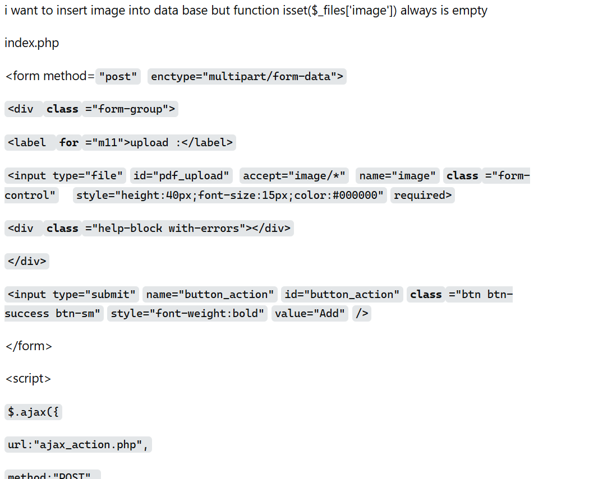
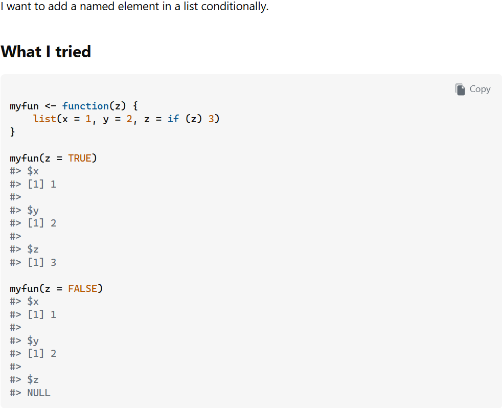
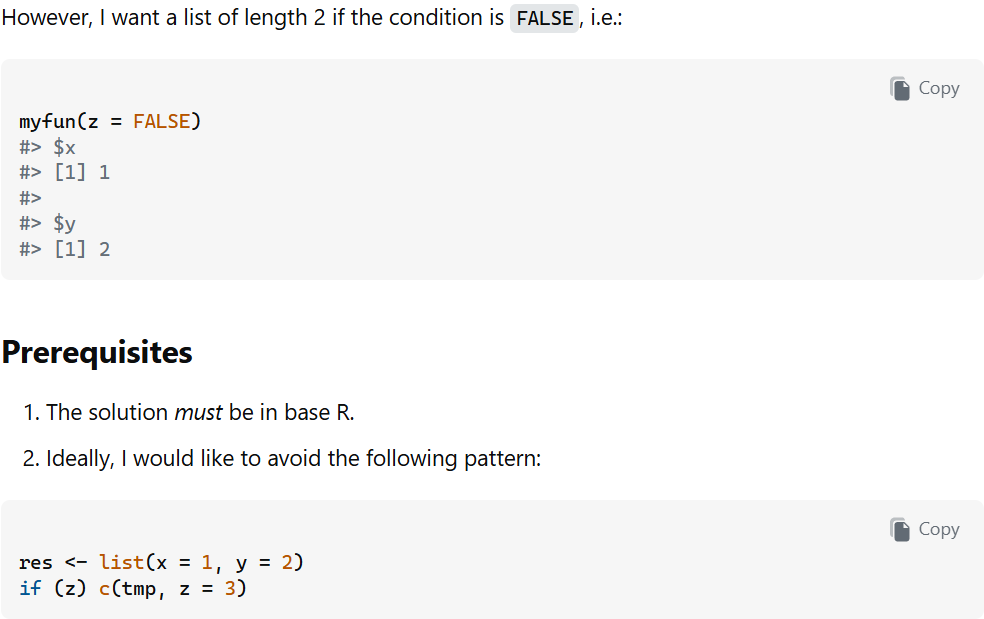

## Eric Raymond's Guide to Smart Questions

Eric Raymond is a software developer and author. He wrote an article entitled [How To Ask Questions The Smart Way](http://www.catb.org/esr/faqs/smart-questions.html). If you haven't read the article, I recommend doing so before asking any technical questions. Raymond explains how to ask questions in a way that makes people more willing to help. He refers to these people as "hackers." Hackers are people who may be willing to answer your questions, often through email, web forums, or open source resources like Stack Overflow. He really stresses the fact that hackers are not obligated to answer your questions. They are there as volunteers, so there are certain guidelines you should follow to get the best chance of getting a helpful response.

First and foremost, <b>do your own research</b>. Before asking someone else for help, you need to put effort into finding your own answer. Sometimes, a simple Google search will get you an answer. If you can find the answer on your own, you avoid wasting someone else's time and can solve your own problem quicker. Other times, however, it might be a little more difficult to find a solution to your problem. In that case, the next step is to look through online forums and their archives. Search through previously answered questions to see if someone else has had the same problem. Many technical questions have already been asked and answered by someone else. If, after all your research, you still can't find a solution, then it may be time to post your question. Make sure to include the research you've done in your question. Let them know that you've tried to find an answer, but haven't had any luck. This shows that you made an effort before asking someone else for help.

When writing out your problem, remember to be polite. Remember that many of these people are volunteers. If your question comes across as hostile, impatient, or arrogant, they may just decide to disregard it entirely. It can never hurt to be nice. 

You should also include enough details to explain your problem clearly. Don't be vague or leave out important details. Add anything that could be useful to someone trying to help you out. At the same time, don't include your own speculations. Write it how it is and only keep it to the necessary things.

## Example of a Poor Question

  

    
     
    <small>Source: <a href="https://stackoverflow.com/questions/80001972/function-isset-always-is-empty">Stack Overflow</a></small>
  

  

    
The image to the left is an example of a "not smart" question. It appears as if this user has not taken the time to do their own research. You can also see how their code is formatted. It makes it really hard to read, which makes it harder for someone to provide any help. In fact, some of the answers are just requests to format it in a way that's more readable. The responses are more focused on the formatting than actually answering the question.

      
    
Another problem is that it looks like this person just dumped all of their code into this question. Not all of it may be relevant to the question they're asking. It just makes it even more difficult to read. It makes the person answering the question search for the problem area within all the code.

      
    
Lastly, this question was closed because it was considered a duplicate question. This is a good example of why it's smart to look through previously asked questions. This person may have been able to find their own solution without having to post their question.

    
As I was finishing up this essay, I noticed that this question was actually removed entirely from Stack Overflow. I think this is just another example of why it's important to ask smart questions.

  

## Example of a Smart Question

  

    
    
     
    <small>Source: <a href="https://stackoverflow.com/questions/80001748/add-a-named-element-conditionally-in-a-list">Stack Overflow</a></small>
  

  

    
These images are examples of a smart question. They start their question by saying what they want to accomplish. Then, they include what they've tried already. They keep the code included very concise. After that, they state the problem with their code. I like how they are very specific with their requirements. They include the prerequisites and even what they <b>don't</b> want to see as an answer. 

    
This kind of question makes it easy to understand because the user is being very specific with what they're looking for. The responses to this question are much more helpful because the question is clear and formatted correctly. There are several different solutions that have been provided that still follow all of the rules set by the user. This allows the person to get the help they requested sooner because the people answering can focus more on the actual question instead of the formatting issues.

  

## What I Learned

Looking at examples of smart and not smart questions really helped me understand the importance of the way I ask questions. I learned that it's important to make answering the question as easy as possible for someone if I want to receive a response. If someone doesn't understand or can't read my question easily, it's likely I won't get the answer I'm looking for. I may not even get an answer at all! The way my question is written can really have an effect on this. Looking back at the poorly written question, the responses were not as helpful as the ones given to the smart question. 

Going forward, I know that I should do my own research before asking a question to avoid unnecessary clutter on these sites. It's possible that it would be a lot quicker to just do research than to go straight to asking my question.

I also want to make sure that I keep in mind that I am not entitled to answers. These are real people going out of their way to answer questions. So although it's possible that my questions won't receive answers, I am still going to make smart questions to give myself the best chance of them being seen.

Communication, in general, is an important part of software engineering because developers often need to work with others to solve problems. I think that being able to ask questions is a great way to improve my communication skills and it's definitely something I want to get better at.
