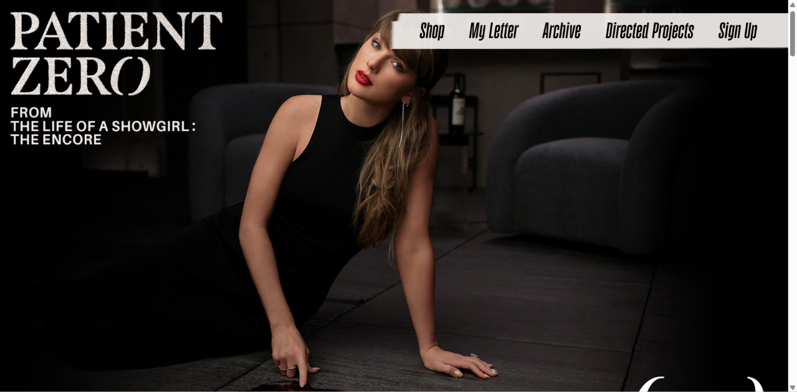
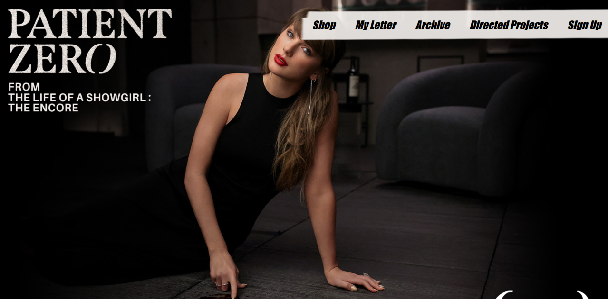
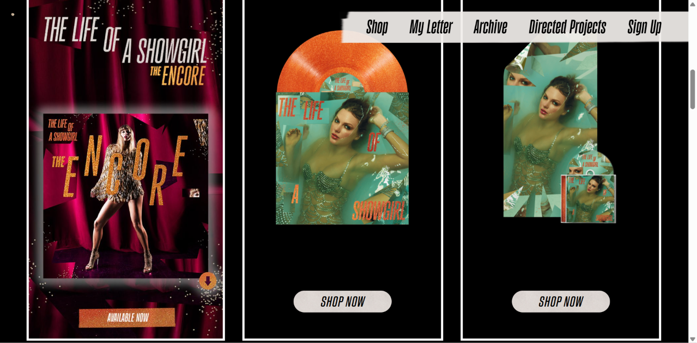
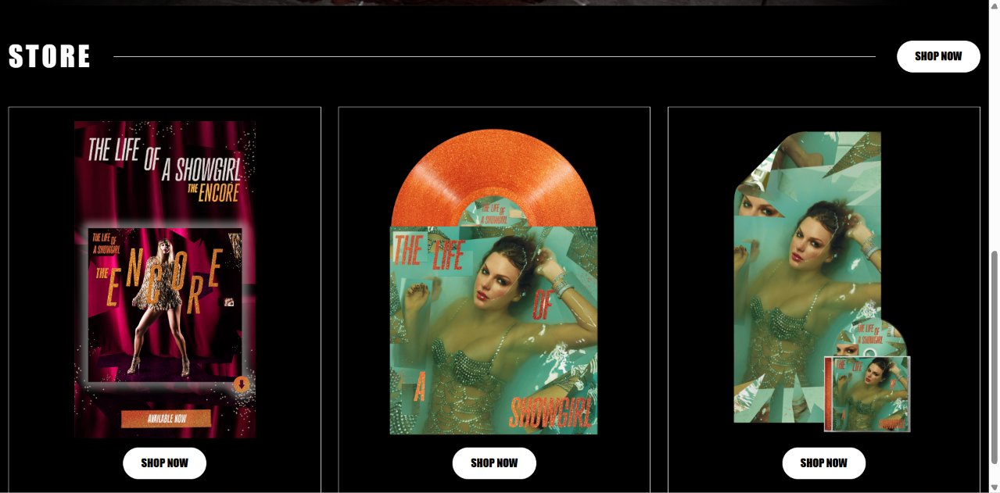

## What is a UI Framework?
A UI Framework is like a set of pre-built tools that are ready to use. In HTML and CSS, you are creating everything from scratch. However, by using a UI framework like Bootstrap 5, it can make you life a whole lot easier.

## Why Should I Bother?
Bootstrap can make your design so much simpler. What once was many lines of code, split into two files can now be done in less lines in just one file. For example, creating a button. Using just HTML, you need CSS to style the button and make it look nice. Using bootstrap, you can do the work of 8 CSS lines in 1.

<table>
<tr>
<th>HTML and CSS</th>
<th>Bootstrap</th>
</tr>

<tr>
<td>

### HTML

```html
<button class="button">Click Me</button>
```

### CSS

```css
.button {
    background-color: #0d6efd;
    color: white;
    border: none;
    padding: 10px 20px;
    border-radius: 5px;
    font-size: 16px;
}

.button:hover {
    background-color: #0b5ed7;
}
```

</td>

<td>

### Bootstrap

```html
<button class="btn btn-primary">Click Me</button>
```

</td>
</tr>
</table>

## Okay... So Bootstrap Can Make Buttons. What Else Can it do?
Bootstrap has many capabilities, but here are some common ones:

<ul>
  <li>Navbars</li>
  <li>Carousels</li>
  <li>Alerts</li>
  <li>Forms</li>
  <li>Dropdowns</li>
  <li>Grids</li>
</ul>

It even has its own library for icons. Instead of having to find your icon, add it to your project, and style it so it looks nice, you can get it directly from Bootstrap. This allows you to spend more time creating your actual website, rather than looking around for the perfect icon. Personally, I spend way too much time trying to make decisions like that and trying to figure out the styling than I should. With this UI framework, I can just plug it in and go on my way.

## Let's Sprinkle in Some Taylor Swift
UI Frameworks can be incredibly helpful while creating websites. You can get the same look, with much less effort. To prove my point, I recreated Taylor Swift's official website in Bootstrap. 

I used Bootstrap for different parts of the website, including the navigation bar, layout, buttons, and responsive design. Instead of creating every part from scratch like I normally would have, I used Bootstrap's existing classes and then added my own CSS to make the website look as close to the original as possible.

The website I created is not an exact copy of Taylor Swift's website. I did not have access to some of the original photos and fonts, so I had to find alternatives that were similar. However, I was still able to recreate a simplified version of the overall layout, colors, navigation, and style of the original website.

<table>
<tr>
<th>Original Taylor Swift Website</th>
<th>My Bootstrap Recreation</th>
</tr>

<tr>
<td>

</td>

<td>

</td>
</tr>

<tr>
<td>

</td>

<td>

</td>
</tr>
</table>
