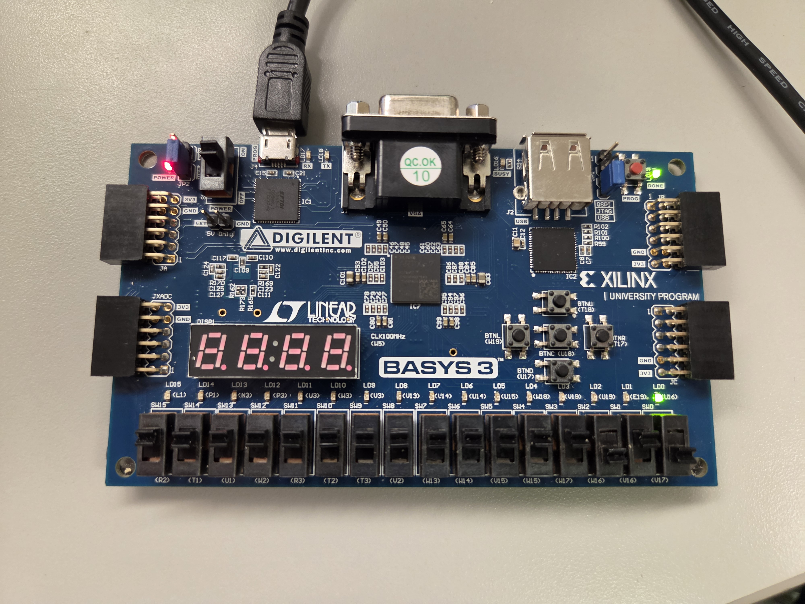
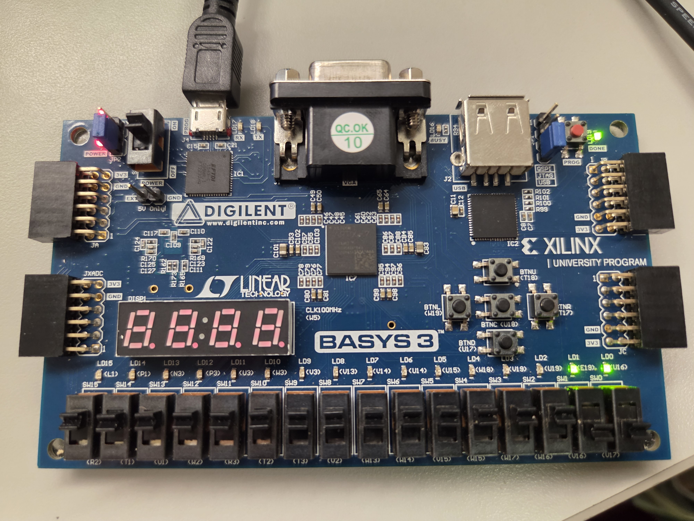
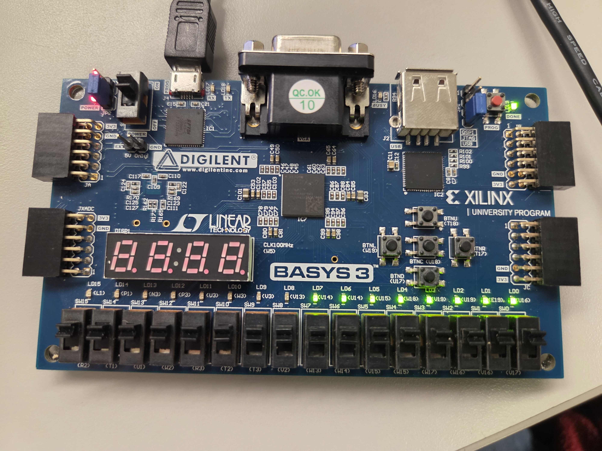
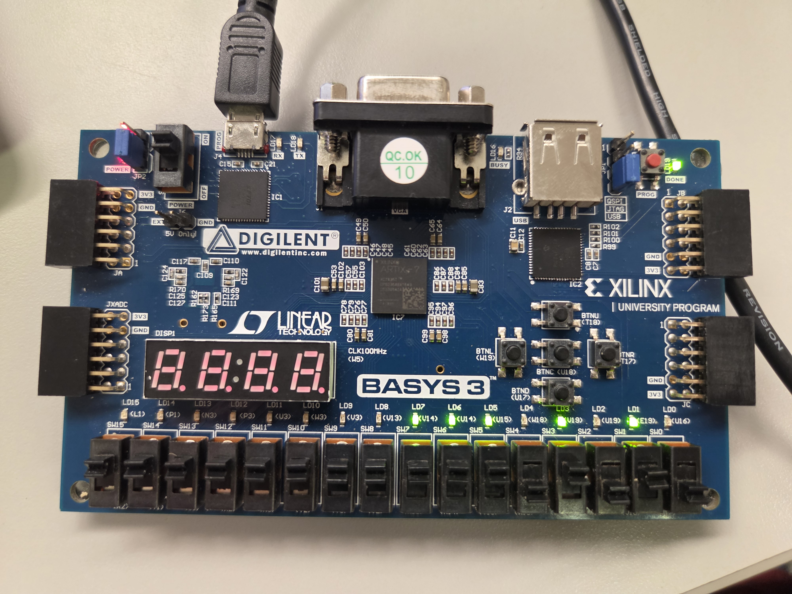

I worked with an FPGA development board to design and implement digital logic circuits using Verilog. These projects gave me hands-on experience programming hardware and testing digital circuits using the physical inputs and outputs on the board.

### 1-Bit Multiplexer

Created a 1-bit 2-to-1 multiplexer in Verilog. The circuit uses a switch to select between two inputs and displays the selected output on the FPGA board.

### 2-Bit Multiplexer

Expanded the multiplexer to two bits, allowing the circuit to select between two 2-bit inputs. This project helped me apply digital logic concepts to a bigger data path.

### Switch-Controlled LEDs

  
  

Connected the FPGA board's input switches to its output LEDs using Verilog dataflow modeling. Each switch controls a corresponding LED, demonstrating how changing the switch inputs changes the LED outputs.
