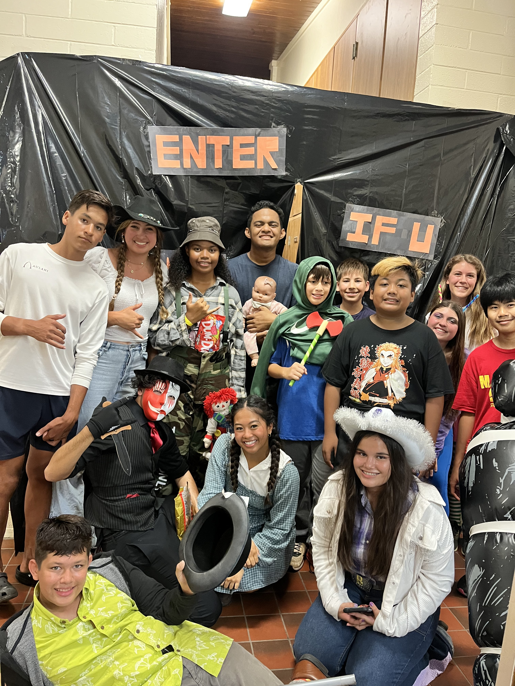

My church traditionally holds a trunk-or-treat event for Halloween each year, which is fun for younger children but often a little boring older youth and adults with less to do. In 2023, I proposed changing the event into a full Halloween party that would have something for everyone.

Working with a team, we planned and organized the entire event, including food, decorations, games, and activities for all ages. We transformed the gym into an area filled with games and activities and designed and built a whole haunted house from scratch in the back of the building.

Our team handled every part of the event, from setting up and decorating to running the activities and participating as scare actors in the haunted house. The event was a success and gave children, youth, and adults an opportunity to enjoy Halloween together.

This experience really taught me a lot about leadership and working with a team. There were so many small things that go into planning an event for 100+ people that I never would have recognized without this experience. I also think it taught me patience and problem solving when things didn't necessarily go the way we expected.
