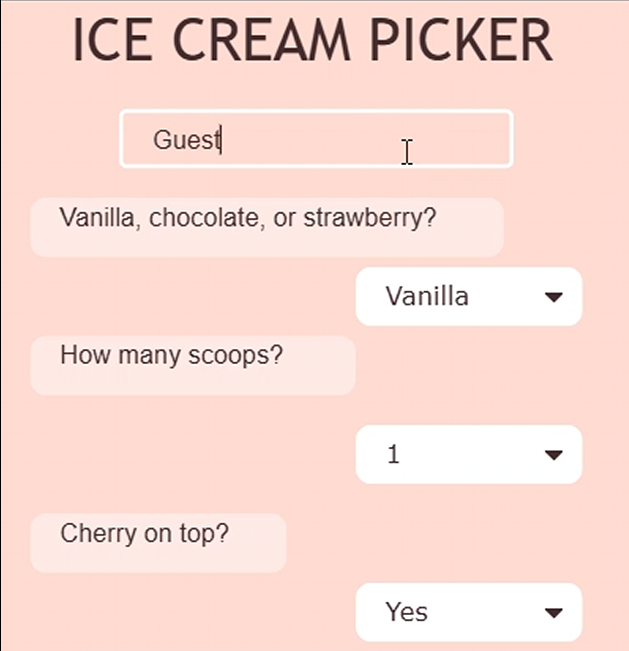

My senior year of high school, I created Ice Cream Picker as a project for AP Computer Science Principles. The game allows players to create their own ice cream cone by choosing their preferred flavors and toppings before setting off on an unexpected adventure.

After the player's ice cream is stolen, they must make a series of choices to navigate through the storyline and try to get it back. Different choices lead the player down different paths, making the game interactive and giving the player more control over how the story unfolds.

Through this project, I gained experience using JavaScript in Code.org to create interactive user experiences while combining game development with storytelling, allowing me to be creative with this project. I also learned how to use conditional logic and user input to create different outcomes based on the player's choices.
